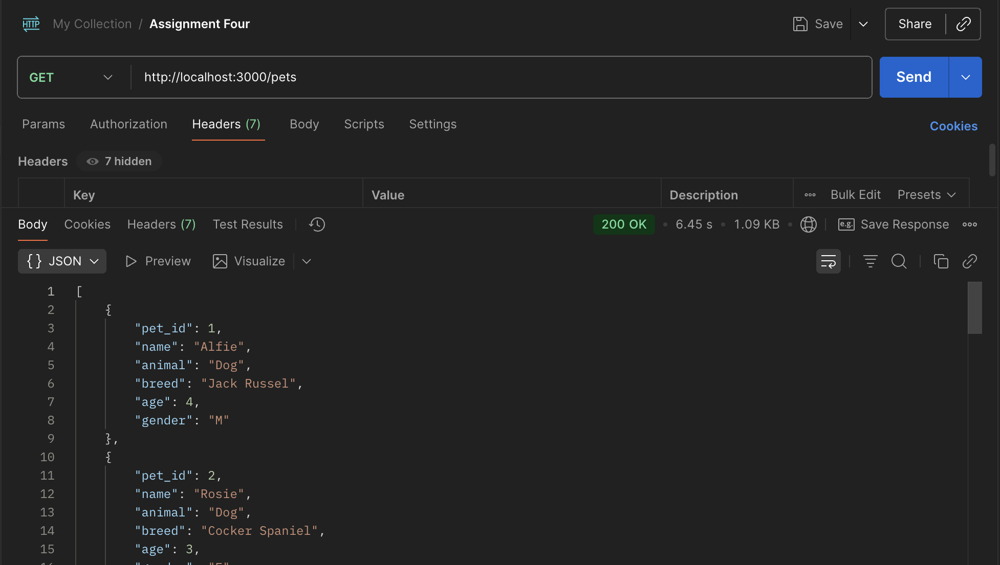
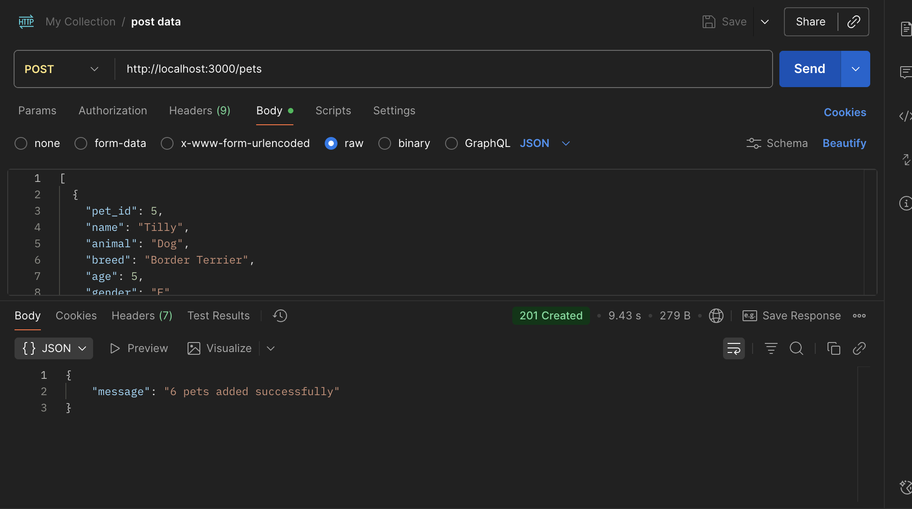
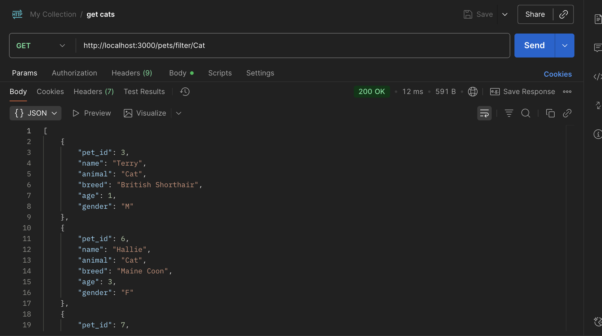
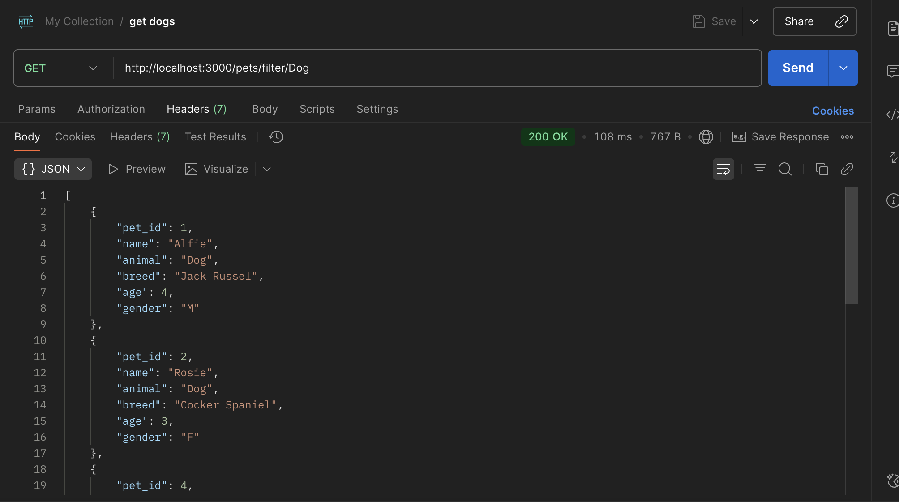
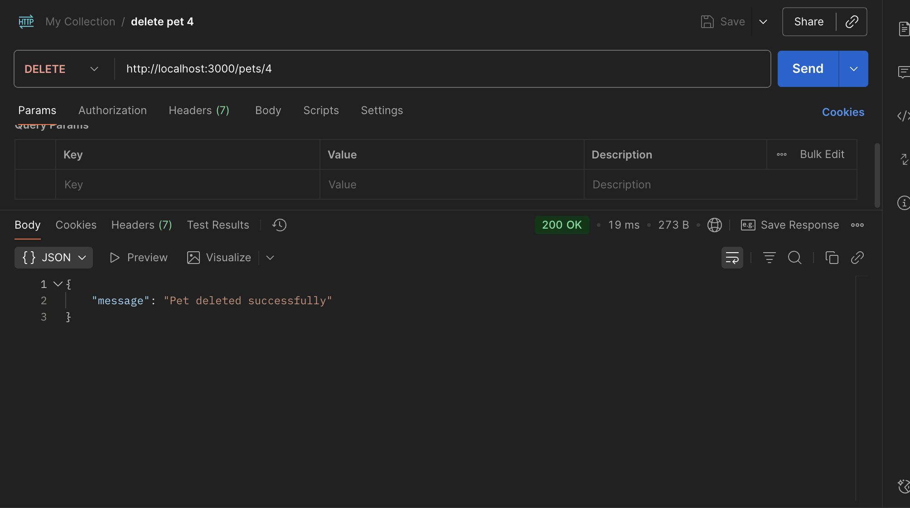

# Pet Adoption API 
## Overview. 
In this assignment, I decided to create a pet adoption API. It is a Node.js and Express application that is connected to a MYSQL database. The purpose behind this is to it allow users, such as staff, who want to manage the information about the pets which are up for adoption. 

**User can:**
- See which animals are up for adoption.
- Add any new pets that are up for adoption.
- Delete pets who have gone to a new home.
- See a filtered version of animals based on whether they're interested in seeing dogs or cats.

This is useful in the real world because at an adoption center, members of staff need to manage available pets quickly and efficiently.    

This API could serve as the backend for a website that has an updated list of the animals that are up for adoption to increase the chances of the pets being adopted. 

## Installation Set Up. 
1. I first created a folder called "assignmentfour-node-api".

2. Once this was created, I installed the package.json file using the code `npm init -y`.

3. I then installed the dependencies: 
- Express was installed with the code `npm install express` 
- Cors and body-parser were installed with the code `npm install cors body-parser`
- MYSQL2 was installed with the code `npm install mysql2` 
- Dotenv was installed with the code `npm install dotenv`

4. Creating relevant files.   
After the installments, I created the relevant files in the "assignmentfour-node-api" folder, which were:
- index.js 
- .env 
- .gitignore

5. Creating the .env file.   
I created an .env file in the "assignmentfour-node-api" folder. 

Once it was created, I inputted the MYSQL database information which is: 
```
DB_HOST=localhost
DB_USER=root
DB_PASSWORD=password
DB_NAME=pet_adoption
PORT=3000
```

6. Creating the .gitignore file.   
It's important that the .gitignore file is created, especially in relation to .env file, as the MYSQL database should stay private due to it containing a password.   

By adding it to the .gitignore file it's ignored when pushed to GitHub.   

It's also important to ignore the node_modules folder as it’s a massive folder and will cause issues if you attempt to push it constantly in your pull requests.   

The code in my .gitignore file is: 
``` 
.env 

node_modules/
```

7. Outlining the scripts in the package.json.   
Before starting the server in the package.json I update the code to include: 
`"main": "index.js",`   
And
```
 "scripts": {
    "start": "node index.js",
    "test": "node index.js"
  },
```

8. Starting the server.\ 
At this point I started the server using the code `npm start`.   

## Creating the database.
The next step I took was to create a database of the pets that are up for adoption.  

Here's the file for the [MYSQL code for creating the database](https://github.com/rosiemittonjames/CFG-Assignments/blob/assignment-4-APIs/Documents/assignmentfour-node-api/creating_api_database.sql)

## Postman.
I first made sure that the server was running with the code `npm start`.   

I then ran a test by using the code `npm run test`.   

Here are the steps I then took with Postman: 
1. I created a new HTTP request on Postman and used the GET method to fetch any existing pets in the database that were up for adoption.   

The expected output of this was to retrieve the 4 pets that were currently in the MYSQL database. 

<picture>  </picture>

2. Secondly, I used POST to add the data of new pets that are up for adoption. The expected output was to add 6 new pets to the MYSQL database.   

For this, I created a new request on Postman with the POST method. I used this code to POST new pets: 

```
[
  {
    "pet_id": 5, 
    "name": "Tilly", 
    "animal: "Dog", 
    "breed": "Border Terrier", 
    "age": 5, 
    "gender": "F"
  },
  {
    "pet_id": 6, 
    "name": "Hallie", 
    "animal: "Cat", 
    "breed": "Maine Coon", 
    "age": 3, 
    "gender": "F"
  },
  {
    "pet_id": 7, 
    "name": "Callie", 
    "animal: "Cat", 
    "breed": "British Shorthair", 
    "age": 9, 
    "gender": "F"
  },
  {
    "pet_id": 8, 
    "name": "Bramble", 
    "animal: "Dog", 
    "breed": "Border Terrier", 
    "age": 3, 
    "gender": "F"
  },
  {
    "pet_id": 9, 
    "name": "Rufus", 
    "animal: "Cat", 
    "breed": "Ragdoll", 
    "age": 8, 
    "gender": "M"
  },
  {
    "pet_id": 10, 
    "name": "Milly", 
    "animal: "Dog", 
    "breed": "Labrador", 
    "age": 2, 
    "gender": "F"
  }
]
```

<picture>  </picture>

3. I then used a POST method to filter the list of pets based on the animal. The expected output with this method was to have a filtered list where the user could see only cats or only dogs.  

Cat filter: 
<picture>  </picture>

Dog filter: 
<picture>  </picture>

4. The final step I took was to use the DELETE method to remove the pet with the ID 4. The expected output of this was to delete the pet with the ID 4 from the MYSQL database. 

<picture>  </picture>